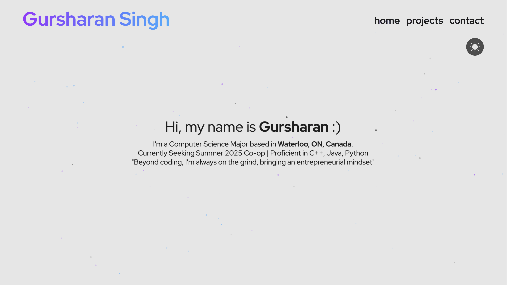

# Personal Website

    
    Live at:
        <a href="https://gursharan007.netlify.app/">
            <b>Gursharan Personal Website</b>
        </a>

Personal website built with Astro, Tailwind CSS, and TypeScript. Deployed with Netlify.

### Pre-requisites

- node.js
- pnpm

### Commands

All commands are run from the root of the project, from a terminal:

| Command                 | Action                                             |
| :---------------------- | :------------------------------------------------- |
| `pnpm install`          | Installs dependencies                              |
| `pnpm run dev`          | Starts local dev server at `localhost:3000`        |
| `pnpm run build`        | Build your production site to `./dist/`            |
| `pnpm run preview`      | Preview your build locally, before deploying       |
| `pnpm run astro ...`    | Run CLI commands like `astro add`, `astro preview` |
| `pnpm run astro --help` | Get help using the Astro CLI                       |
| `netlify deploy --prod` | Deploy via Netlify CLI                             |
